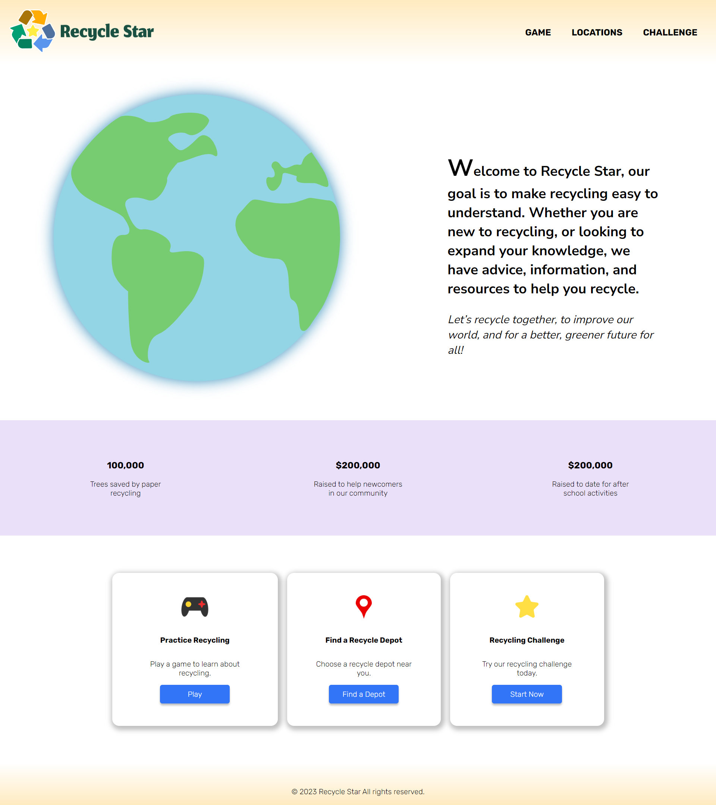

# Recycle-Star

Recycle Star was born out of the personal experience of one of our team members who faced the challenges of navigating recycling practices when she first arrived in Canada. Recognizing the difficulties many newcomers face in understanding the recycling system and the disparities between their home countries and Canada, we were inspired to create a solution. Our aim is to provide a user-friendly and interactive website that serves as a comprehensive resource, addressing the specific needs of newcomers. To ensure accessibility for users with color blindness, Recycle Star has been thoughtfully designed with color-blind-friendly colors. 

# Tech Stack

HTML, CSS, JavaScript, Bootstrap

# What next?
<li>Add sound effects on box rotation</li>
<li>Implement a database to store the generated numbers</li>
<li>Implement a feature to allow users to save their favourite numbers</li>
                    
# Getting Started

1. Clone the repository:

```
git clone https://github.com/kendicey/Recycle-Star.git
```

2. Ready to run:
   Open with live server
